# concurrency-and-asynchrony-task

<h2>IO-bound</h2>
Суть задания - посетить 100 случайных страниц в Википедии и сохранить все ссылки с этих страниц. Затем проанализировать скорость их обработки, используя ThreadPoolExecutor.

Этим кодом запишем все ссылки в файл res.txt:

    from urllib.request import urlopen
    from urllib.parse import unquote
    from bs4 import BeautifulSoup
    from tqdm import tqdm
    
    url = 'https://ru.wikipedia.org/wiki/%D0%A1%D0%BB%D1%83%D0%B6%D0%B5%D0%B1%D0%BD%D0%B0%D1%8F:%D0%A1%D0%BB%D1%83%D1%87%D0%B0%D0%B9%D0%BD%D0%B0%D1%8F_%D1%81%D1%82%D1%80%D0%B0%D0%BD%D0%B8%D1%86%D0%B0'
    
    res = open('res.txt', 'w', encoding='utf8')
    
    for i in tqdm(range(100)):
        html = urlopen(url).read().decode('utf8')
        soup = BeautifulSoup(html, 'html.parser')
        links = soup.find_all('a')

        for l in links:
            href = l.get('href')
            if href and href.startswith('http') and 'wiki' not in href:
                print(href, file=res)

Всего получилось 786 ссылок

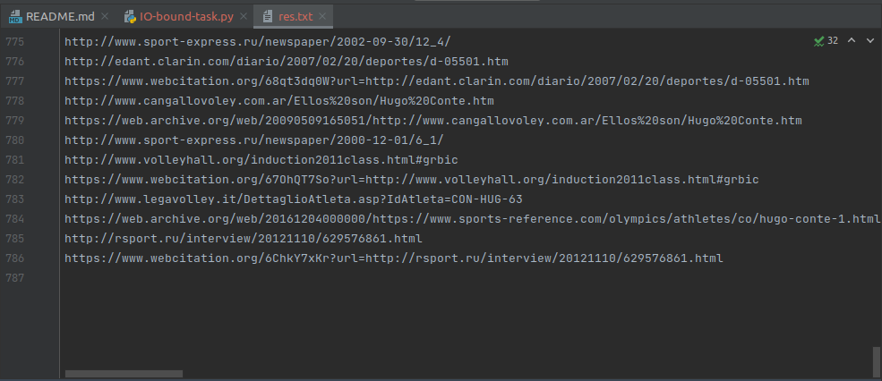

На протяжении работы программы количество используемой памяти почти не изменялось, а нагрузка на проессор находилась в районе 60%, периодически улетая в 98-100%. В конце (график ЦП) отчетливо видно момент, когда программа завершила работу:

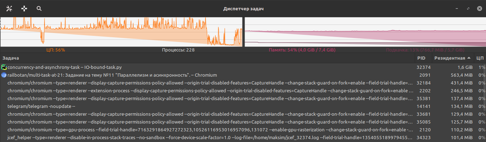

Всего на обработку одним потоком 786 ссылок ушло 1242 секунды:

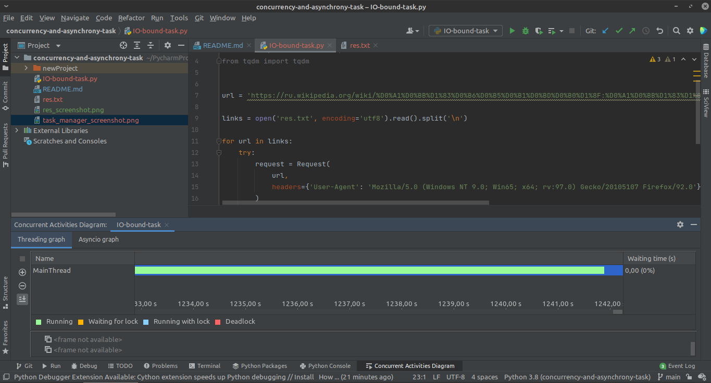

Теперь перепишем код, используя ThreadPoolExecutor:

    import concurrent.futures
    import urllib
    from urllib.request import urlopen, Request
    
    links = open('res.txt', encoding='utf8').read().split('\n')
    
    
    def load_url(url, timeout):
        with urllib.request.urlopen(url, timeout=timeout) as conn:
            return conn.read()
    
    
    with concurrent.futures.ThreadPoolExecutor(max_workers=5) as executor:
        future_to_url = {executor.submit(load_url, url, 60): url for url in links}
        for future in concurrent.futures.as_completed(future_to_url):
            url = future_to_url[future]
            try:
                request = Request(
                    url,
                    headers={'User-Agent': 'Mozilla/5.0 (Windows NT 9.0; Win65; x64; rv:97.0) Gecko/20105107 Firefox/92.0'},
                )
            except Exception as exc:
                print(url, exc)
            else:
                print(url)

И теперь сравним время работы и нагрузку на ЦП одного потока с временем работы с 5, 10, 100 workers:

С max_workers=5:

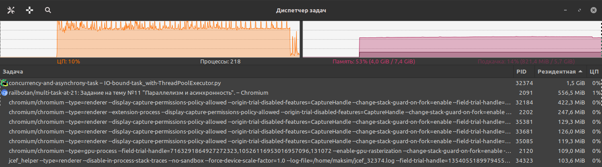
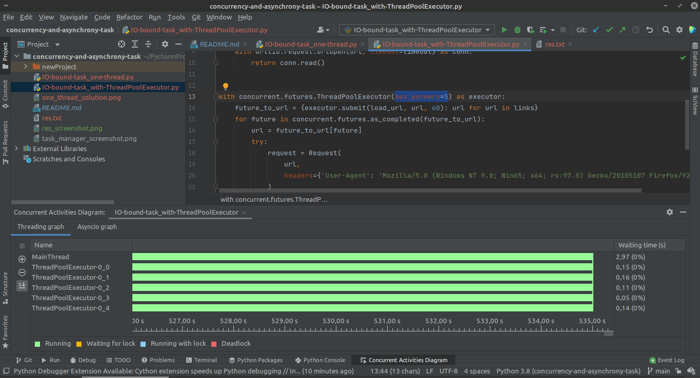

C max_workers=10:

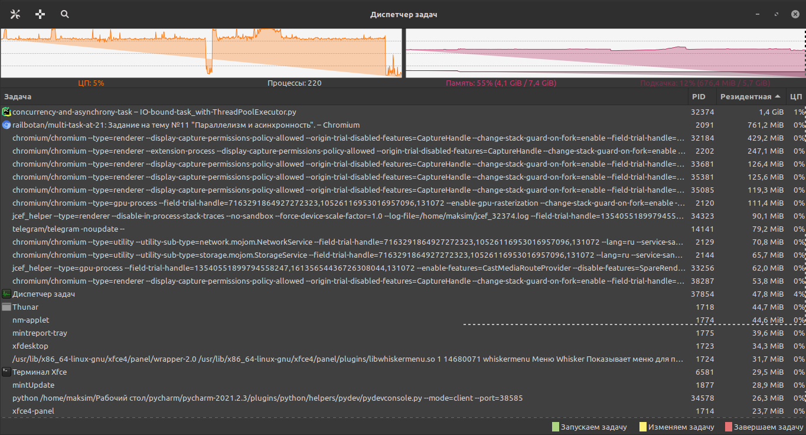
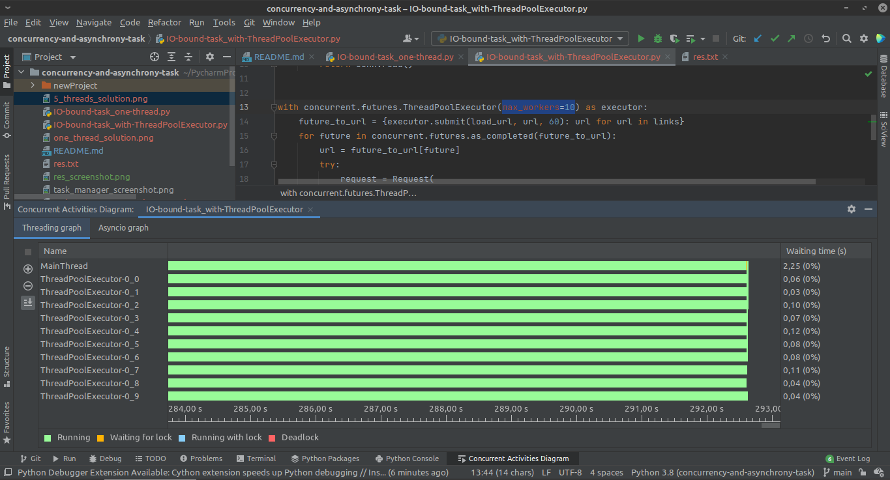
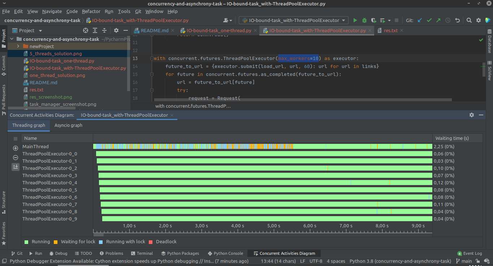
На диаграмме диспетчера (график ЦП) тест начинается примерно в середине (после проседания),его и стоит анализировать. 
На 3м скриншоте видны задержки первые 5.5 секунд в MainThread

И с max_workers=100:

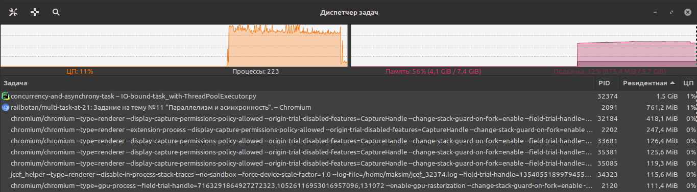
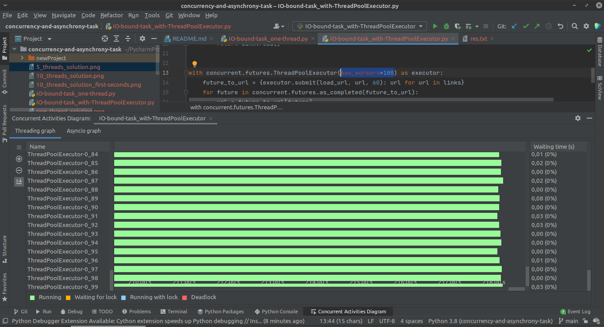
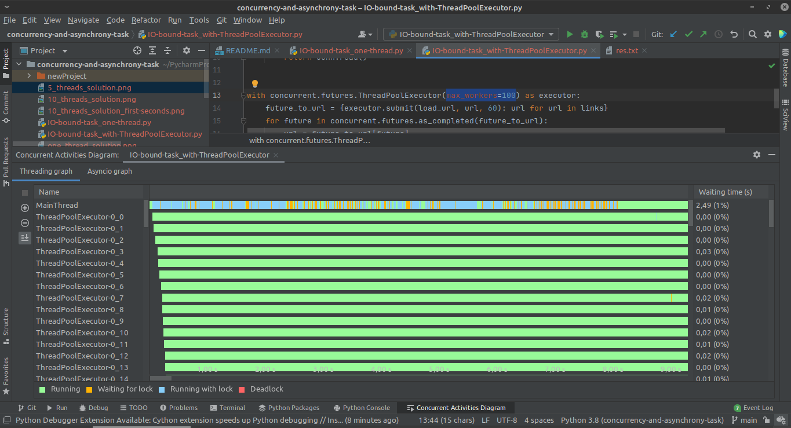
На 3м скриншоте также видны задержки в MainThread, но уже в течение 8 секунд.
Всего ушло 218 секунд (на скриншоте может быть плохо видно)

В итоге по графикам видно, что количество потоков в IO-bound задаче никак не влияет на количество используемой памяти. Нагрузка на процессор при max_workers=5 не сильно отличается от нагрузки при max_workers=100, т.е. использование ThreadPoolExecutor увеличивает нагрузку на процессор, но предельное значение уровня нагрузки достигается почти сразу и дальнейшее увеличение количества воркеров ведет только к изменению времени. 

Теперь о времени. Для 5, 10 и 100 воркеров время работы составило 535, 292 и 218 секунд соответственно. Значит увеличение количества потоков ведет к увеличению скорости работы, но постепенно увеличение количества потоков будет приводить ко все меньшему увеличению производительности, пока не будет достигнут предел.

_____
